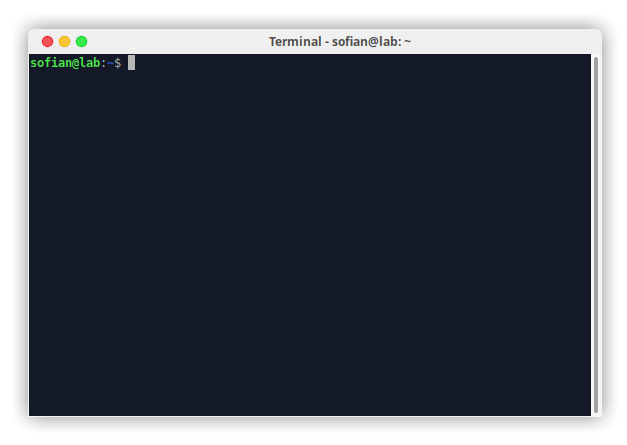

# About
A small window button version of XFWM theme MacOS Big Sur. Compatible with xfce4.
# Installation
Place xfwm4 to `./themes` in your HOME for a local user, `/usr/share/themes/` for a global user. 

# Screenshot

**Note:** If `.themes` in your HOME directory doesn't exist, create it.

Thanks to [Zayronxio](https://www.pling.com/u/zayronxio/) for making a such great theme.
